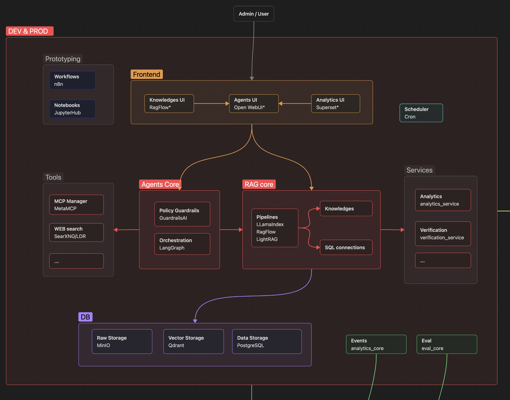
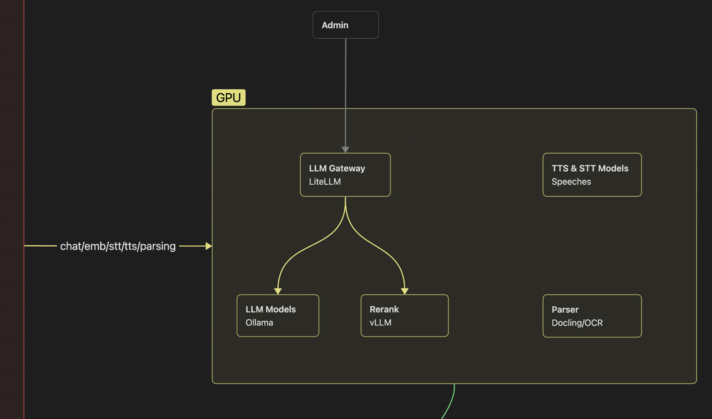
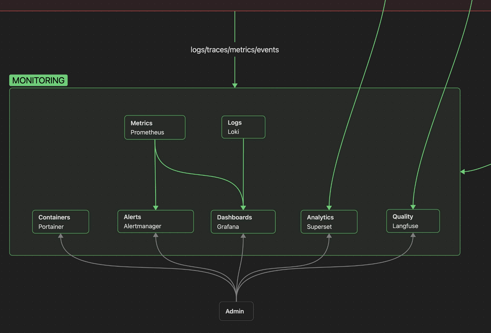

# Axioma AI

An enterprise AI assistant platform for the Axioma asset management system used in the energy domain.

### Goal

The goal of the platform is to help users work with a complex enterprise system: understand domain data, navigate workflows, find the right information, and perform assisted creation or editing of business objects.

### Architecture Overview

The platform is built as a private AI layer around enterprise data, domain documentation, and system APIs. It combines RAG, SQL access, norm-control workflows, local LLM infrastructure, and observability into a production-oriented assistant platform.

**Development and production layer:** web UI, LangGraph orchestration, RAG pipelines, MCP/tool integrations, SQL connections, services, storage, and deployment structure.

**GPU and model layer:** LiteLLM gateway, local models through Ollama/vLLM, parsing/OCR components, and speech-related model services for private/on-premise AI usage.

**Monitoring layer:** metrics, logs, dashboards, analytics, quality tracing, containers, alerts, and Langfuse-based LLM observability.

### What I Built

- Designed the architecture of a production-oriented AI platform rather than a simple chatbot.
- Built multi-agent orchestration with specialized agents for different classes of tasks.
- Implemented domain RAG pipelines for documentation, regulations, internal knowledge, and system-specific context.
- Added a SQL sub-agent for structured data analysis and question answering over enterprise data.
- Designed norm-control workflows to validate generated outputs against business and regulatory requirements.
- Integrated the assistant with enterprise APIs and internal services.
- Deployed local LLM infrastructure on company servers for private, on-premise usage.

### Stack

Python, FastAPI, LangGraph, LangChain, LlamaIndex, RAG, SQL agents, LiteLLM, Langfuse, PostgreSQL, Docker, local LLMs, Ollama, vLLM, REST APIs, Grafana, Prometheus, Loki.

### My Role

Lead AI Engineer / AI Platform Architect. I am responsible for architecture, backend implementation, agent design, local model infrastructure, technical direction, and coordination of the AI development work.

I work with backend engineers, QA, product stakeholders, and domain experts while owning the AI architecture, core implementation, and technical direction of the assistant platform.
