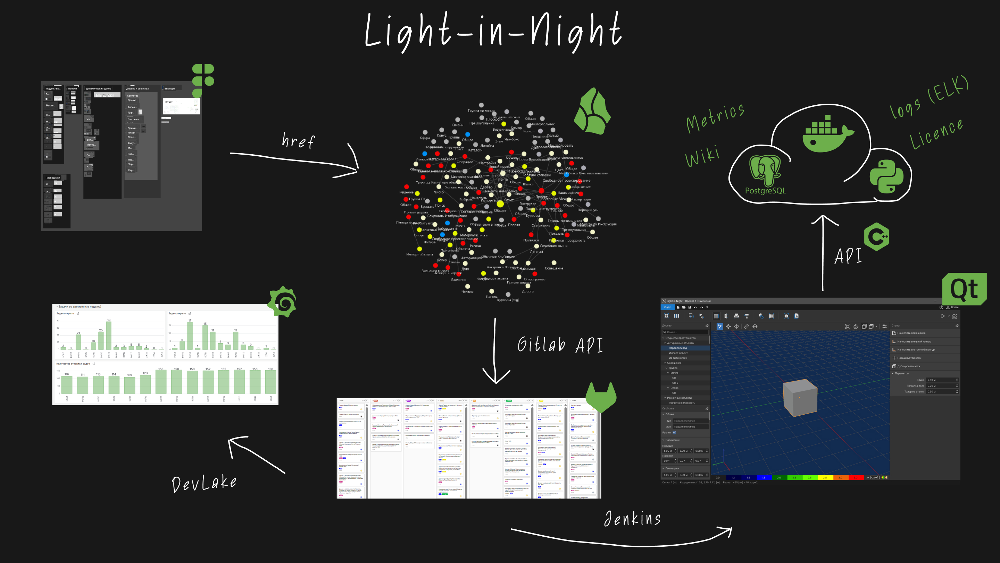

# Light in Night

A professional desktop application for indoor and outdoor lighting calculation, design, and project preparation.

I joined the project when it was closer to a technical demo with unclear processes, fragmented planning, and an incomplete product workflow. My work was focused on turning it into a managed product development process with a full engineering team.

### Goal

The goal was to build a production-ready lighting design application and organize the development process around requirements, releases, quality control, and coordinated work between engineering, QA, design, analytics, and management.

### Product Overview

**Product and engineering layer:** desktop lighting design workflow, calculation modules, UI/UX work, backend services, task tracking, release planning, logging, metrics, QA processes, and AI-assisted development experiments.

### What I Built

- Organized the product development process from requirements and specifications to GitLab issues, backlog, release planning, and delivery tracking.
- Built and managed a cross-functional team of 10+ people across C++, Python, frontend, DevOps, QA, UX/UI design, and analytics.
- Coordinated technical planning, product analysis, task decomposition, and release management.
- Developed backend modules and internal services in Python.
- Set up logging and metrics collection with Elasticsearch, Kibana, and Grafana.
- Initiated LLM usage for UI testing automation and AI-assisted development workflows with tools such as Aider.

### Stack

C++, Python, desktop development, backend services, GitLab, Elasticsearch, Kibana, Grafana, QA automation, LLM-assisted development.

### My Role

Team Lead / Product Analyst. I was responsible for analytics, specifications, planning, backend development, process organization, team coordination, and overall technical leadership across engineering, QA, design, and product work.
