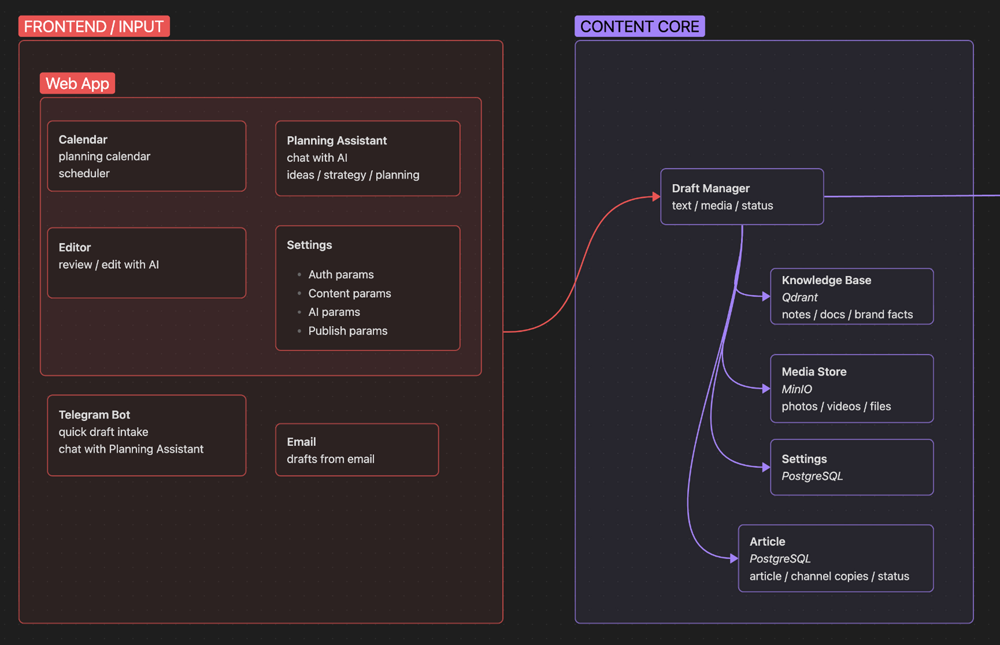
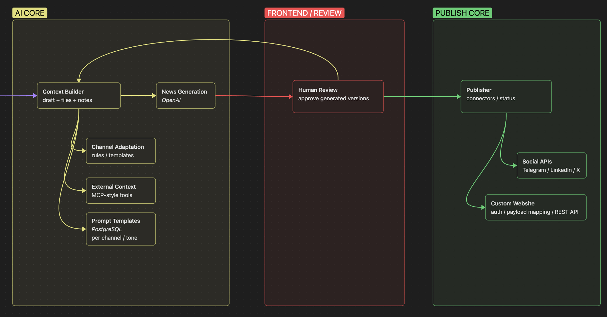

# Smart Publish

An AI-assisted publishing platform for preparing, adapting, scheduling, and publishing news content across websites and social platforms.

The project was not a fully autonomous agent. It was a structured AI workflow: the user creates or uploads a draft, the AI prepares versions for selected destinations, the user reviews the result, and the system publishes or schedules the approved content.

### Goal

The goal was to reduce repetitive editorial work for teams and individual creators who publish the same information across multiple channels: websites, Telegram, LinkedIn, X/Twitter, Reddit, Facebook, and custom CMS integrations.

### Architecture Overview

The platform was organized as a predictable publishing pipeline. Input channels and editorial tools collected drafts, the content core stored articles and context, the AI core generated and adapted versions, and the publishing core sent approved content to connected destinations.

**Input and content layer:** web app, planning assistant, editor, calendar, Telegram and email intake, draft management, media storage, settings, articles, and knowledge base context.

**AI, review, and publishing layer:** context building, news generation, channel adaptation, prompt templates, external context, human review with regeneration loop, publisher, social APIs, and custom website connector.

### What I Built

- Designed a structured AI publishing workflow instead of a generic chatbot.
- Built the draft-to-publication pipeline: draft intake, context preparation, article generation, channel adaptation, review, approval, and publishing.
- Added a lightweight Planning Assistant for content ideas, simple publishing calendars, short article briefs, and draft preparation.
- Designed prompt templates and rules for adapting one source draft to different platforms and tones.
- Implemented a human review loop so users could edit, regenerate, approve, or schedule generated versions before publication.
- Designed the custom website connector concept with configurable auth, request mapping, media upload, article creation, and response parsing.
- Connected the workflow to Telegram, email intake, CMS APIs, social publishing APIs, and external context sources.

### Stack

Python, FastAPI, OpenAI API, structured prompt orchestration, Telegram API, REST APIs, CMS integrations, social platform APIs, n8n/background jobs, relational database, object storage, configurable connectors.

### My Role

Lead AI Engineer. I designed the product architecture, built the backend and AI workflow, created the prompt/template structure, integrated Telegram and CMS APIs, designed the custom connector approach, and prepared the system for additional publishing destinations.

I worked in a small outsourcing team with backend, QA, and product/design collaboration while owning the AI workflow architecture and core backend implementation.
