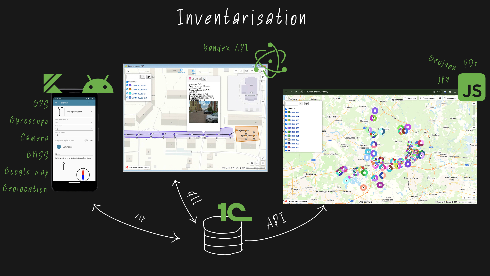
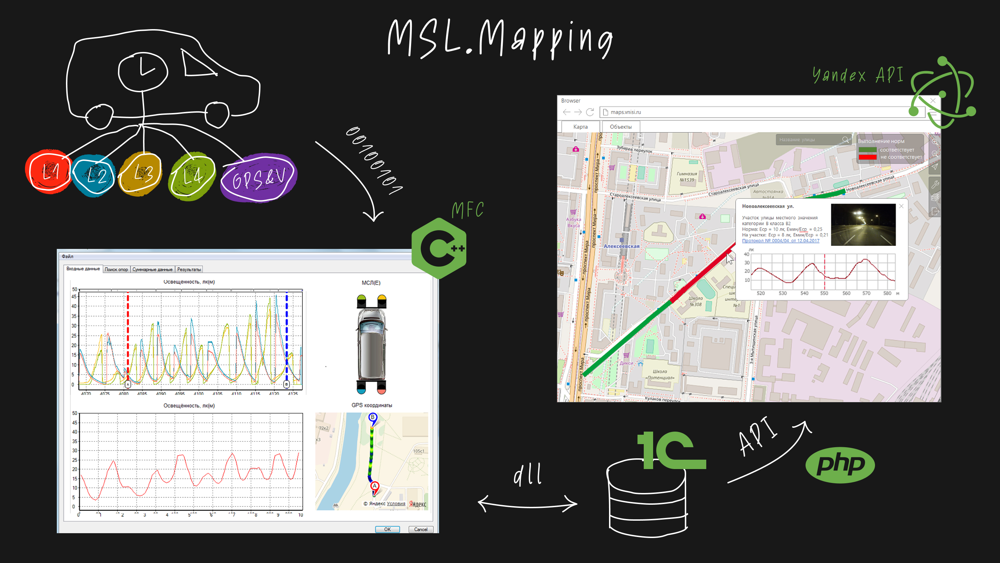
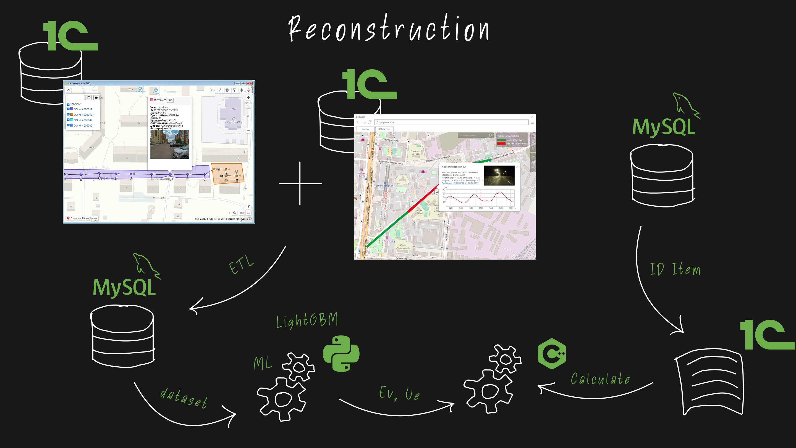

# Urban Lighting Platform

An urban lighting data and ML platform for field inventory, mobile laboratory measurements, geospatial mapping, and LightGBM-based reconstruction planning.

The project combined several earlier tools into one pipeline: collect field data, process real illuminance measurements, map the results, train an ML model, and prepare reconstruction recommendations.

### Goal

The goal was to make urban lighting reconstruction planning faster and more data-driven: replace manual field reports and fragmented maps with reusable datasets, prediction models, analytics, and planning documents.

### Project Evolution

The platform grew from three connected engineering stages. The strongest part was the final ML and analytics layer; the earlier tools created the structured data needed for prediction and reconstruction planning.

**Field inventory layer:** Android and desktop tools for collecting poles, luminaires, coordinates, photos, and object metadata during field inspections.

**Measurement layer:** processing of mobile laboratory data: GPS tracks, sensor measurements, illuminance values, road segments, and map visualization.

**ML reconstruction layer:** dataset preparation, LightGBM-based illuminance prediction, detection of non-compliant zones, LED replacement recommendations, economic calculations, and tender materials.

### What I Built

- Designed the platform as a pipeline from field data to ML-assisted reconstruction planning.
- Built tools for outdoor lighting asset inventory and map-based data management.
- Developed processing logic for mobile laboratory measurements, GPS tracks, and illuminance data.
- Connected inventory, measurement, and geospatial data into reusable datasets.
- Built the ML dataset and LightGBM model for street illuminance prediction.
- Added analytics for lighting quality, reconstruction options, LED replacement, economic effect, and planning documentation.

### Stack

Android, Electron, JavaScript, Node.js, C++, MFC, GPS/sensor data processing, 1C, PostgreSQL/MySQL-style databases, geospatial data, Python, LightGBM, feature engineering, Google Maps API.

### My Role

Technical lead and full-stack developer. I designed key parts of the architecture, developed data processing components, built the ML dataset and prediction model, and connected field data, measurements, maps, and analytics into a reconstruction planning workflow.

I coordinated work with software developers, analysts, and field engineering stakeholders to connect practical data collection needs with the ML and planning layer.
