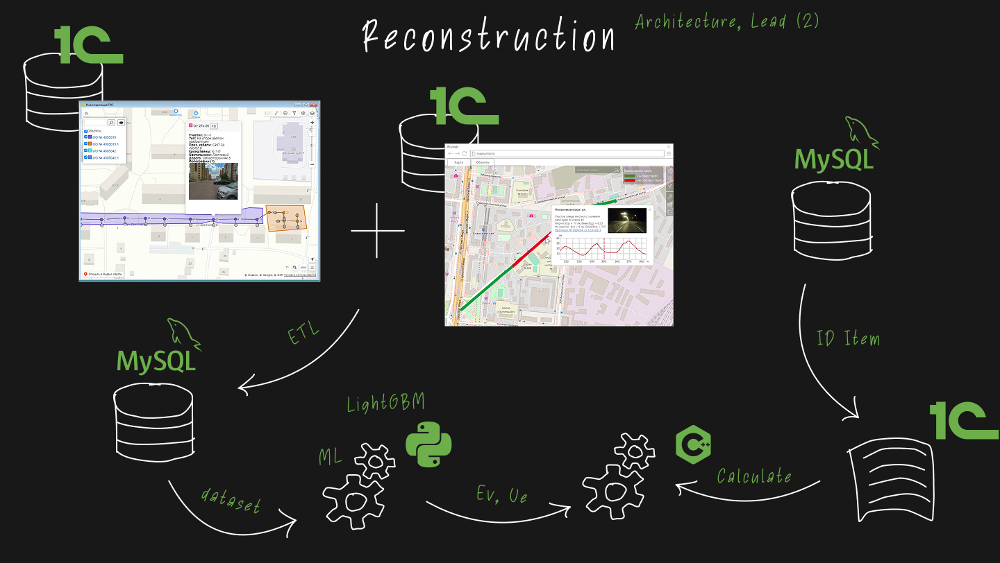

# Urban Lighting Platform

An end-to-end urban lighting data and ML platform that combined three related systems: field inventory, mobile laboratory measurements, geospatial mapping, and LightGBM-based reconstruction planning.

The strongest part of the project was the final ML and analytics layer. Earlier tools collected and structured the data; the reconstruction module turned that data into predictions, recommendations, and planning documents.

## Context

The project grew inside BL-Group / Center for Innovative Developments from several practical engineering tasks:

- collect lighting asset data in the field;
- process real illuminance measurements from a mobile laboratory;
- combine everything on a map;
- use this data to predict street lighting quality;
- prepare reconstruction options and tender documentation faster.

Instead of treating these as separate tools, I now describe them as one platform: a pipeline from field data to ML-assisted urban lighting planning.

## 1. Field Inventory

The first part automated outdoor lighting asset inventory. Before this, the process was mostly manual: field data was collected on paper, digitized later, and plotted on maps by third-party contractors.

I worked on a software suite that included:

- Android application for field data collection;
- GPS, camera, and object attributes capture;
- centralized storage in 1C / database systems;
- Electron desktop application for map visualization and data management;
- report generation for clients and internal teams.

This created the structured asset layer: poles, luminaires, coordinates, photos, and object metadata.

## 2. Mobile Laboratory Mapping

The second part processed measurements from a mobile lighting laboratory. A vehicle collected illuminance, speed, GPS, and sensor data while driving through streets.

I developed and integrated tools for:

- parsing raw binary sensor data;
- synchronizing measurements with GPS tracks;
- visualizing illuminance along road segments;
- storing processed data in the internal database;
- displaying results on an interactive map.

This created the measurement layer: real lighting levels tied to geography.

## 3. ML Reconstruction Planning

The final and most important stage connected inventory and measurement data into a predictive reconstruction workflow.

The system used matched geospatial data to build an ML dataset and train a LightGBM model for street illuminance prediction. This made it possible to estimate lighting quality in areas where repeated field measurements would be expensive or slow.

The ML and analytics layer supported:

- illuminance prediction based on inventory and street data;
- detection of zones that did not meet lighting requirements;
- LED replacement recommendations;
- economic effect and payback calculations;
- automated preparation of analytical materials for reconstruction planning and tenders.

## Result

The platform connected data collection, measurement processing, mapping, prediction, and reconstruction analytics into one planning workflow. It reduced manual work, made field data reusable, and helped prepare reconstruction proposals faster and with better technical justification.

## Stack

- **Field tools:** Android, Electron, JavaScript, Node.js.
- **Measurement processing:** C++, MFC, GPS/sensor data processing.
- **Data and storage:** 1C, PostgreSQL/MySQL-style databases, geospatial data.
- **ML:** Python, LightGBM, dataset preparation, feature engineering.
- **Visualization:** JavaScript, Google Maps API.

## My Role

I worked as technical lead and full-stack developer across the platform evolution. I designed key parts of the architecture, developed data processing components, built the ML dataset and prediction model, and connected field data, measurements, maps, and analytics into a reconstruction planning workflow.
