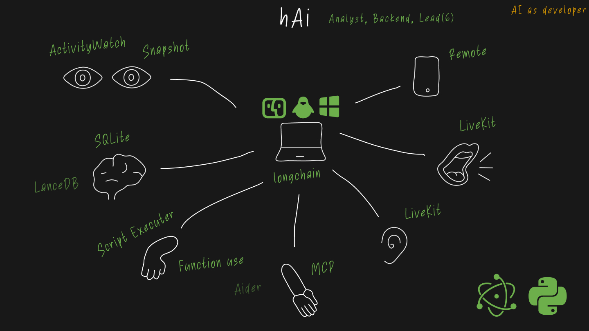

### hAi (local-first AI assistant for computer control) | [Project Website](https://hi-ai.app/)

**hAi** is my personal open-source R&D project focused on building a local-first desktop AI assistant. I started it as a way to explore what a real personal AI assistant could become: not just a chat window, but a system that understands the user's computer context, works with local models, uses tools, and can gradually become a universal desktop companion.

**Key Idea:**
To create an assistant that has a cognitive memory model, tracks user activity on the computer, supports voice interaction, works with local and cloud models, and can be extended through tools and protocols such as MCP.

**Architecture and Stack:**
The system is built as a **distributed local application**. The core, based on **Python/FastAPI**, manages agent logic, memory, model routing, and tool use. Specialized services such as **LiveKit** for voice communication and **ActivityWatch** for desktop activity context run as independent components.

The project is also my practical environment for experimenting with modern AI assistant architecture: local LLMs, Mac Studio inference optimization, agent UX, contextual memory, MCP tool integrations, voice interaction, and AI-assisted development workflows. I actively use it in my own work and continue preparing it for a public release.

- **Backend:** Python, FastAPI, LangChain, SQLAlchemy.
- **Frontend:** Electron, React, TypeScript.
- **AI:** Integration with cloud and local LLMs (OpenAI, Gemini, Ollama), Computer Vision (Moondream), and STT/TTS solutions (Whisper, Piper).
- **DB**: SQLite, LanceDB.
- **Protocols:** REST, SSE, and **MCP (Model Context Protocol)** for connecting external tools.

**My Role:**
I am the founder and lead developer of the project. I designed the architecture, implemented the backend core, built the agent and memory concepts, integrated local and cloud models, and use the project as a real testbed for AI assistant development.
